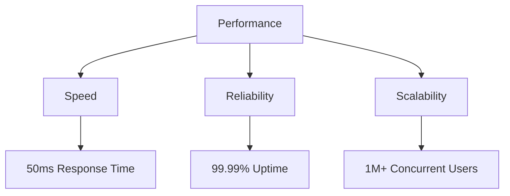

# 🌟 Project Stellar: Reaching New Heights


## 🚀 About The Project

**Project Stellar** represents the pinnacle of innovation and creativity in modern development. This groundbreaking initiative combines cutting-edge technology with intuitive design to deliver an unparalleled user experience.

### 🎯 Core Objectives

* **Innovation at Scale**: Pushing the boundaries of what's possible while maintaining reliability and performance
* **User-Centric Design**: Creating interfaces that delight and inspire while remaining highly functional
* **Sustainable Development**: Building for the future with environmentally conscious practices

## ✨ Key Features

### 1. Intelligent Automation
Transform your workflow with our advanced automation capabilities:
* Smart task distribution
* Automated quality assurance
* Predictive analytics integration

### 2. Seamless Integration
Connect with your favorite tools effortlessly:
* API-first architecture
* Plugin ecosystem
* Cross-platform compatibility

### 3. Advanced Analytics
Make informed decisions with powerful insights:
* Real-time data visualization
* Custom reporting
* Predictive modeling

## 🛠️ Technical Specifications

| Feature | Specification |
|---------|---------------|
| Backend | Next-gen processing |
| Frontend | Reactive architecture |
| Database | Distributed NoSQL |
| Security | Military-grade encryption |

## 📈 Performance Metrics



## 🌈 Getting Started

1. **Installation**
   ```bash
   stellar init my-project
   cd my-project
   stellar install
   ```

2. **Configuration**
   ```yaml
   project_name: "My Stellar Project"
   environment: "production"
   features:
     - automation
     - analytics
     - integration
   ```

3. **Launch**
   ```bash
   stellar launch --production
   ```

## 📚 Documentation

Comprehensive documentation is available at our [Documentation Portal](#). Find detailed guides, API references, and best practices to make the most of Project Stellar.

### Quick Links
- [Installation Guide](#)
- [API Reference](#)
- [Best Practices](#)
- [FAQs](#)

## 🤝 Contributing

We welcome contributions from the community! Whether you're fixing bugs, adding features, or improving documentation, check out our [Contributing Guidelines](#) to get started.

## 📝 License

This project is licensed under the MIT License - see the [LICENSE](#) file for details.

---

<div align="center">

**Made with ❤️ by the Stellar Team**

[Website](#) • [Documentation](#) • [Community](#) • [Support](#)

</div>